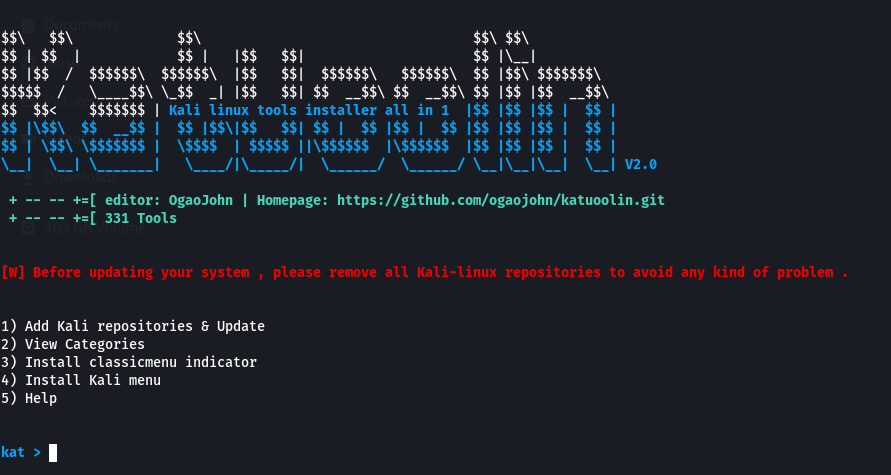

### Main katuoolin

# katuoolin
With just a click it allows you to install all Kali linux tools.

# Features
- View available respositories
- Add Kali linux repositories
- Remove kali linux repositories
- Install Kali linux tools

# Requirements
- Python 2.7
-sudo apt-get install python2.7
- An operating system (tested on kali)

# Installation on kali
- sudo su
- git clone https://github.com/ogaojohn/katuoolin.git && cp katuoolin/katuoolin.py /usr/bin/katuoolin
- chmod +x /usr/bin/katuoolin
- sudo katuoolin 

# Video
https://www.youtube.com/watch?v=ogaojohn

# Usage
- Typing the number of a tool will install it
- Typing 0 will install all Kali Linux tools
- back : Go back
- gohome : Go to the main menu
- By installing armitage , you will install metasploit

# Warning
Before updating your system , please remove all Kali-linux repositories to avoid any kind of problem .

# I have some questions!

Please visit https://github.com/ogaojohn/katuoolin/issues

# Donations
- Paypal : ogaojohn10@gmail.com
- skrill : ogaojohn10@gmail.com

# Contact

- Youtube : https://youtube.com/ogaojohn
- Whatsapp : https://web.whatsapp.com/ogaojohn
- x: @ogaojohn
- Email : ogaojohn10@gmail.com
